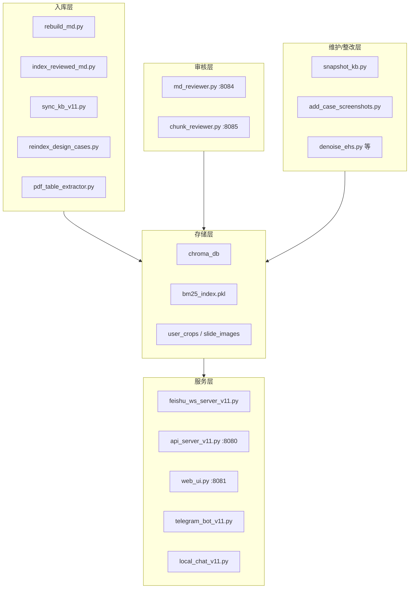

# doc_parser_v11 程序库总览

**项目路径**：`~/doc_parser_v11/`  
**整理日期**：2026-06-12  
**定位**：私有化 EHS / 工程知识库问答系统

---

## 一、这是什么

`doc_parser_v11` 是一套完整的 **知识库工程**，不只是单个解析脚本。它把公司制度、国家法规、各部门案例等文档，变成可检索的知识片段（chunk），再通过飞书机器人（及网页、Telegram 等）提供自然语言问答。

员工在飞书提问 → 系统双轨检索（向量 + BM25）→ 精排 → 大模型整合答案 → 必要时附图。

---

## 二、核心数据资产

| 资产 | 路径 | 作用 |
|------|------|------|
| 源文件 | `Local_KB/` | 原始 PDF / DOCX / XLSX / PPTX |
| 审核后 Markdown | `reviewed_md/` | 常规文档入库前的中间产物 |
| 向量库 | `chroma_db/` | 全库 chunk + bge-m3 嵌入 |
| BM25 索引 | `bm25_index.pkl` | 关键词检索，与向量混合 |
| 案例配图 | `user_crops/`、`slide_images/` | 检索命中后随答案发图 |
| 问答日志 | `qa_logs/` | 检索与生成过程可追溯 |
| 删块回收站 | `deleted_chunks/` | 8085 删除的 chunk 可恢复 |
| 解析缓存 | `batch_output/` | MinerU 等中间输出 |
| 失败隔离 | `Failed_PDFs/` | 三引擎均失败的 PDF |

### 知识库顶层 domain（`Local_KB/`）

```
Local_KB/
├── 国家规定/
├── 公司内部/
├── EHS案例/
├── 工管部/
├── 客关部/
├── 设计部/
└── 合约部/
```

顶级文件夹名即 **domain**，写入每个 chunk 的 metadata，供检索过滤。

---

## 三、系统分层



**一句话**：入库程序把文件变成 chunk → 审核程序人工修 → 服务程序检索问答 → 维护程序做批量整改。

---

## 四、三条入库路线（关键）

### 路线 A：常规文档（制度、规范、工管部等）

```
放文件到 Local_KB/
    ↓
rebuild_md.py              # 解析 → reviewed_md/*.md（增量 skip）
    ↓
md_reviewer.py (8084)      # 人工删目录、修表格、插图
    ↓
index_reviewed_md.py       # 章节感知切块 → chroma_db
    ↓
重启飞书 / 重建 BM25
```

- **适用**：`公司内部`、`国家规定`、`工管部` 等文字为主文档
- **不走** Vision LLM，**必须** 经 MD 人工审核
- **自动跳过**：`EHS案例` 及路径中含「案例」的子目录

### 路线 B：案例类（EHS案例、各部门「案例」子目录）

```
放文件到 Local_KB/.../案例/
    ↓
sync_kb_v11.py             # 逐页 PNG + 文字不足则 Vision LLM
    ↓
chunk_reviewer.py (8085)   # 对已入库块质检、补图
    ↓
重启飞书 / 重建 BM25
```

- **适用**：`EHS案例`，以及 `设计部/案例/`、`客关部/排雷库` 等
- **无 MD 中间文件**，直接入向量库
- 每页通常一个 chunk，可带 `image_path` 或正文 `[📷 ...]` 标签

### 路线 C：设计部案例「重制」（专项）

```
reindex_design_cases.py    # 仅 6 个固定文件
    ↓
原始文字 + 整页截图 → 删旧块 → 入库 → 重建 BM25
```

- **绕过** Vision LLM 和常规 sync 流程
- 详见 `reindex_design_cases_功能说明.md`

### 路线对照表

| 路线 | 适用 | 入口脚本 | 生成 MD | 审核工具 |
|------|------|---------|---------|---------|
| A 常规 | 制度/规范/工管部等 | `rebuild_md.py` → `index_reviewed_md.py` | ✅ | 8084 |
| B 案例 | EHS案例、*/案例/ | `sync_kb_v11.py` | ❌ | 8085 |
| C 重制 | 设计部 6 文件 | `reindex_design_cases.py` | ❌ | 8085（抽查） |

> **工管部走路线 A**，不要用 `sync_kb_v11.py`。  
> **合约部案例**入库方案尚未落地（计划改 sync 路由 + `--domain 合约部`）。

---

## 五、飞书检索链路

```
用户提问
  → ChromaDB 向量检索 (k=20, bge-m3)
  + BM25 关键词检索 (k=20, jieba)
  → RRF 互惠排名融合
  → domain / 封闭库过滤
  → is_index 索引聚合（命中清单文件时整份拉取）
  → Reranker 精排 (bge-reranker-v2-m3, top 8)
  → 豆包 doubao-seed-2.0-pro 生成答案
  → 解析 [📷 路径] 附图发出
```

**私有化说明**：Embedding、Reranker、BM25、向量库均在本地；LLM 调云端 API，仅发送用户问题与检索到的片段。

---

## 六、程序清单（按角色）

### 6.1 入库主程序

| 程序 | 职责 |
|------|------|
| **`sync_kb_v11.py`** | 全库增量同步。扫描 `Local_KB/`，对新文件按格式路由（PDF MinerU/Vision、PPTX、DOCX、Excel），`add_documents` 入库。支持 `--domain` 过滤。 |
| **`rebuild_md.py`** | 常规文档解析器，输出 `reviewed_md/`。增量 skip，自动跳过案例目录。 |
| **`index_reviewed_md.py`** | 审核通过的 MD 切块入库。CHUNK_SIZE=2000，支持 `--force`、`--file`。 |
| **`pdf_table_extractor.py`** | PDF 三引擎模块（MinerU 乱码时 pdfplumber / pymupdf 兜底），被 sync 引用。 |
| **`reindex_design_cases.py`** | 设计部 6 文件专项重制：直接文本 + 整页截图，删旧入库 + BM25。 |

### 6.2 人工审核工具

| 程序 | 端口 | 职责 |
|------|------|------|
| **`md_reviewer.py`** | 8084 | 入库**前**审 MD：源 PDF 全页 \| 编辑 \| 预览。保存到 `reviewed_md/`。 |
| **`chunk_reviewer.py`** | 8085 | 入库**后**审 chunk：框选截图、改正文、补 `[📷 ...]`、确认进度、回收站。直接写 chroma + 重建 BM25。详见 `chunk_reviewer_8085_功能说明.md`。 |

### 6.3 对外服务（问答入口）

| 程序 | 端口/方式 | 职责 |
|------|-----------|------|
| **`feishu_ws_server_v11.py`** | WebSocket | **主力**。检索 + 生成 + 发图 + qa_logs；监控 `bm25_index.pkl` 热加载。 |
| **`start_feishu.sh`** | 后台启动 | 启动飞书服务，自动重建 BM25。PID 记 `feishu.pid`。 |
| **`api_server_v11.py`** | 8080 | FastAPI 检索网关，供网页 UI 调用。 |
| **`web_ui.py`** | 8081 | 浏览器聊天界面。 |
| **`telegram_bot_v11.py`** | Telegram | 复用飞书检索核心。 |
| **`local_chat_v11.py`** | 终端 | 本地 Ollama 调试，与飞书链路分离。 |

### 6.4 备份与安全

| 程序/操作 | 职责 |
|-----------|------|
| **`snapshot_kb.py`** | 改动前 chroma 全量快照（含 id），作 before 基线。 |
| **`chroma_db.bak_*`** | 各脚本或手动整库备份目录。 |
| **`chunk_reviewer` 回收站** | `deleted_chunks/` 存删块 JSON（含原始向量），可恢复。 |

### 6.5 EHS / 案例内容整改（常带 `--write`）

| 程序 | 职责 |
|------|------|
| **`denoise_ehs.py`** | 删 EHS 块页眉/版权/页码等噪音行。 |
| **`rework_ehs.py`** | 按样板批量整改同类块。 |
| **`ehs_autocrop.py`** | 自动裁剪案例整排配图。 |
| **`reformat_cases.py`** | 排雷库案例重排成 V3.0 字段格式。 |
| **`reformat_huarun_cases.py`** | 华润类案例表格解析与重排。 |
| **`rework_positive.py`** | 正面案例·字段卡型块重排。 |
| **`add_case_screenshots.py`** | 自动检测蓝框、裁剪配图，替换 `[📷 待补]`，更新 `user_crops/index.json`。 |
| **`fix_jingxi_images.py`** | 惊喜库等设计案例配图修复（一次性工具）。 |
| **`parse_sync_log.py`** | 解析 sync 日志，生成处理报告。 |

### 6.6 Shell 脚本

| 脚本 | 职责 |
|------|------|
| **`start_feishu.sh`** | 后台启动飞书机器人。 |
| **`run_pipeline.sh`** | 流水线封装（视项目配置而定）。 |

---

## 七、端口一览

| 端口 | 服务 | 启动命令 |
|------|------|---------|
| 8080 | 检索网关 | `venv/bin/python api_server_v11.py` |
| 8081 | 网页聊天 | `venv/bin/python web_ui.py` |
| 8084 | MD 审核 | `venv/bin/python md_reviewer.py` |
| 8085 | Chunk 质检 | `venv/bin/python chunk_reviewer.py` |
| — | 飞书机器人 | `bash start_feishu.sh` |

本机访问：`http://127.0.0.1:端口`

---

## 八、技术栈

| 组件 | 技术 |
|------|------|
| 向量库 | ChromaDB（`chroma_db/`） |
| Embedding | BAAI/bge-m3（CPU） |
| BM25 | rank-bm25 + jieba → `bm25_index.pkl` |
| Reranker | bge-reranker-v2-m3（CPU） |
| 问答 LLM | 豆包 doubao-seed-2.0-pro（云端 API） |
| Vision LLM | 同上（案例逐页识图） |
| PDF 解析 | MinerU（CPU）+ PyMuPDF + pdfplumber |
| 格式转换 | LibreOffice headless |
| 审核 UI | Gradio |
| 凭据 | 项目根 `.env`（飞书、火山 API、Telegram 等） |

---

## 九、典型场景速查

| 你想做的事 | 用哪个程序 |
|------------|-----------|
| 新加工管部制度 PDF | `rebuild_md.py` → 8084 → `index_reviewed_md.py` |
| 新加 EHS 负面案例 PPT | `sync_kb_v11.py --domain EHS案例` |
| 设计部惊喜库改成原文+整页图 | `reindex_design_cases.py` |
| 已入库案例改字、补图 | 8085 或 `add_case_screenshots.py` |
| 飞书问答 | `bash start_feishu.sh` |
| 大批量改库前保命 | `snapshot_kb.py` 或脚本内 `chroma_db.bak_*` |
| 看问答检索过程 | `qa_logs/`、`logs/feishu_ws_server_v11_*.log` |

---

## 十、程序依赖关系

```
Local_KB/（源文件）
    │
    ├─[路线A] rebuild_md.py → reviewed_md/ → md_reviewer(8084)
    │                              ↓
    │                    index_reviewed_md.py
    │
    ├─[路线B] sync_kb_v11.py ← pdf_table_extractor.py
    │              ↓
    ├─[路线C] reindex_design_cases.py
    │              ↓
    └──────────→ chroma_db/ ← chunk_reviewer(8085)
                        ↓
                 bm25_index.pkl
                        ↓
              feishu_ws_server_v11.py
              api_server_v11.py → web_ui.py
              telegram_bot_v11.py
```

整改脚本（`add_case_screenshots`、`denoise_ehs` 等）均读写 `chroma_db`，多数会触发或需手动重建 BM25。

---

## 十一、相关文档

| 文档 | 内容 |
|------|------|
| `使用手册_完整版.md` | 操作步骤、常见坑、一页速查 |
| `EHS知识库_方案说明_20260608.md` | 架构、检索方案、封闭库机制 |
| `SYSTEM_DOC.md` | 技术细节、切块设计、文件处理流水线 |
| `项目汇报_EHS智慧助手.md` | 对外汇报简版 |
| `reindex_design_cases_功能说明.md` | 设计部案例重制脚本 |
| `chunk_reviewer_8085_功能说明.md` | 8085 质检工具 |

---

## 十二、环境与启动

```bash
cd ~/doc_parser_v11
source venv/bin/activate   # 或命令前加 venv/bin/python
```

MinerU 配置 `~/magic-pdf.json` 中 `device-mode` 须为 `"cpu"`（本机无 GPU 时）。

---

## 十三、一句话总结

**doc_parser_v11 = 入库流水线 + 双审核台 + 多通道问答服务 + 一批整改工具 + 向量/BM25 双检索体系。** 不同文档类型走不同路线，改动最终汇聚到 `chroma_db` 与 `bm25_index.pkl`，由飞书机器人对外提供「可检索、可附图、可追溯」的 EHS 智慧问答。

---

*持续迭代中。合约部案例入库、设计部重制后验收等任务见各专项文档与任务卡。*
